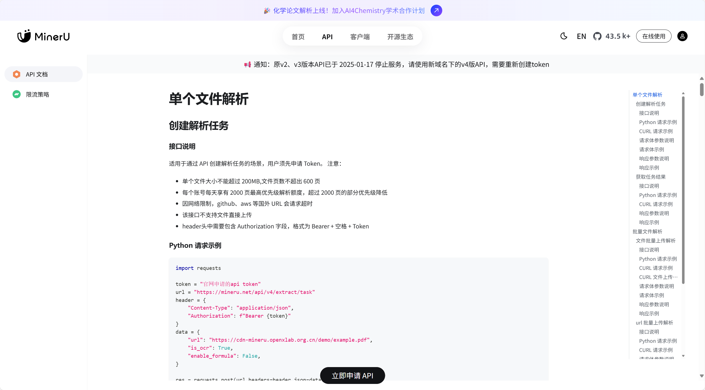

## MinerU API 申请

如需申请或管理您的 MinerU API，请访问我们的官方 API 文档门户。

[
**MinerU API申请**
](https://mineru.net/apiManage/docs)

---

!!! tip  "重要通知：旧版 API 已停用"

    原 v2、v3 版本 API 已于 **2025-01-17** 停止服务。请务必切换至新域名下的 **v4 版 API**，并需要重新创建 Token。

## 内测阶段限流策略

当前 MinerU API 处于内测运行阶段，为确保稳定服务体验，对用户执行以下限流策略：

* **上传限制**：单个文件大小不超过 **200 MB**，单个上传文件页数不超过 **600** 页。
* **解析页数限制**：每个账号每天不限解析页数，但需要遵守我们的优先级策略。每个用户享有 **2000 页最高优先级**解析额度，超过 2000 页的部分优先级将会降低（此额度在自然日内统计）。

---

!!! tip "温馨提示"

    * 内测期间，我们将根据系统负载情况动态调整限流规则，您可能会遇到限流的临时变更。
    * 请确保上传的文件符合规范，超出限制的请求将被系统自动拒绝。
    * 如果您的使用需求超出当前限额，欢迎联系我们的运营团队 [opendatalab@pjlab.org.cn](mailto:opendatalab@pjlab.org.cn)，协商适合的解决方案。